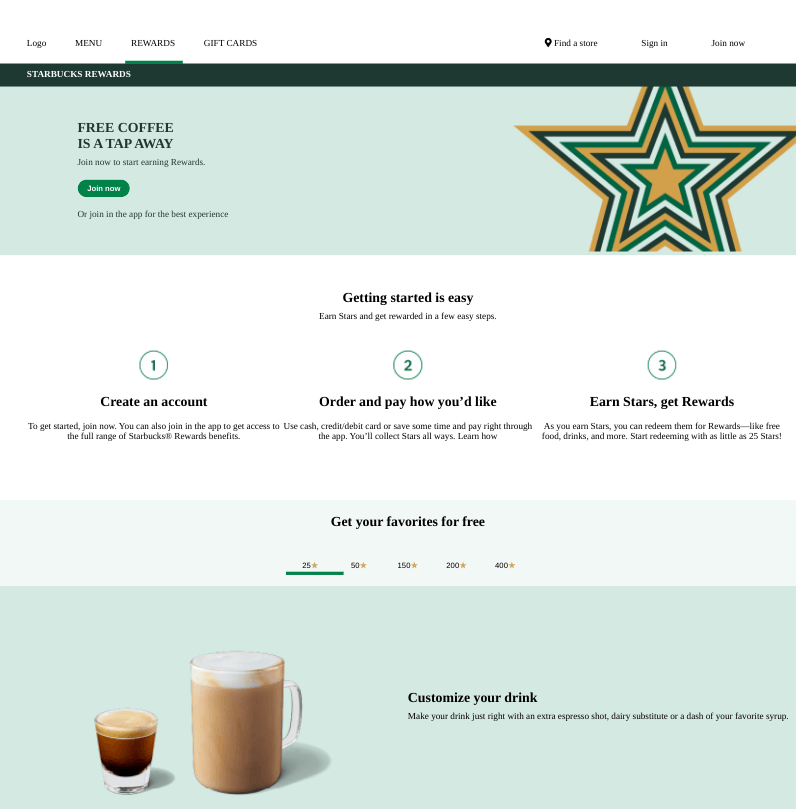

<h1 align="center">Starbucks Rewards Page</h1>

   Solution for a challenge from  <a href="https://frontendpractice.com" target="_blank">Frontendpractice.com</a>.

  <h3>
    <a href="https://jdegand.github.io/starbucks-rewards-page/">
      Github Pages
    </a>
     | 
    <a href="https://www.frontendpractice.com/project/starbucks">
      Frontend Practice    
    </a>
  </h3>

## Table of Contents

- [Overview](#overview)
  - [Built With](#built-with)
- [Features](#features)
- [Useful Resources](#useful-resources)

## Overview

### Built With

- CSS Grid
- Flexbox

## Features

The [challenge](https://www.frontendpractice.com/project/starbucks) was to build an application to complete the following user stories:

- [x] User story: Recreate the layout
- [x] User story: Add the "Skip to Main Content" button that appears when pressing tab after the page loads.
- [ ] User story: In the tab section, animate the bottom border moving left/right when selecting a new tab.

## Useful Resources

- [Starbucks](https://web.archive.org/web/20211001004822/https://www.starbucks.com/rewards)
- [Image Downloader](https://imgdownloader.com/) - download all images from website
- [W3 Schools](https://www.w3schools.com/html/html_symbols.asp) - html symbols
- [W3 Schools](https://www.w3schools.com/howto/howto_js_tabs.asp) - JS Tabs
- [JavaScript Tutorial](https://www.javascripttutorial.net/javascript-dom/javascript-siblings/) - JS Siblings
- [Font Awesome](https://fontawesome.com/v5.15/how-to-use/on-the-web/styling/sizing-icons) - Sizing icons
- [Favicon Grabber](https://favicongrabber.com/) - get favicon from website
- [Get Favicon](http://www.getfavicon.org/) - get favicon from website
- [W3](https://www.w3.org/2005/10/howto-favicon) - favicon
